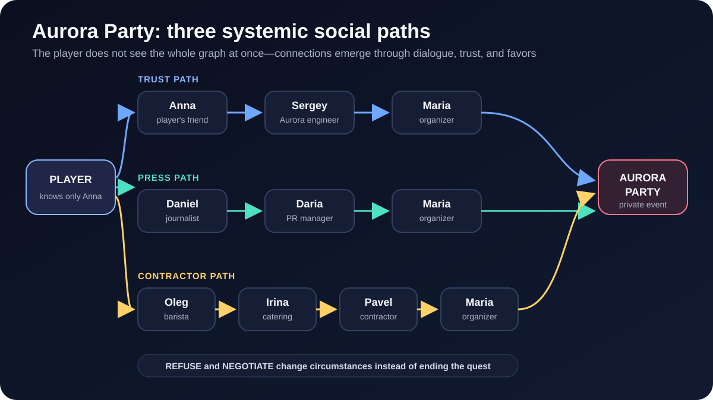
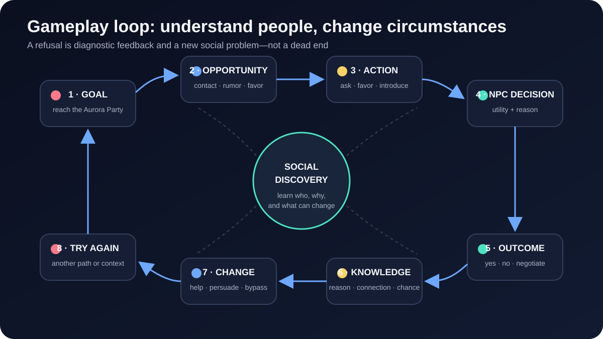
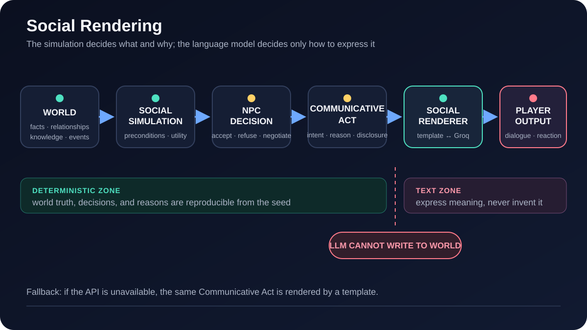
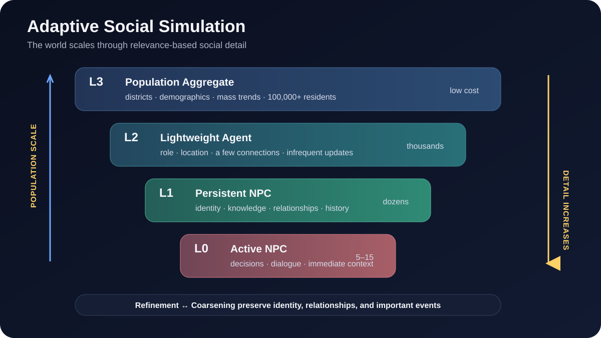

# Adaptive Social Immersive Sim

An experimental single-player **social immersive sim** built with Godot 4. The
player is not an overseer managing society from above, but an ordinary
participant in a living social world. Goals are achieved through connections,
trust, information, reputation, favors, and organizations.

The first vertical slice revolves around gaining access to a private **Aurora**
party. There is no single predefined solution: the player must investigate
relationships, negotiate, help people, and discover alternative social paths.

[](docs/diagrams/aurora-social-paths.svg)

## Gameplay Loop

The player does not press an abstract persuasion button. They learn why someone
is unwilling to help, change the relationship or circumstances, and try a new
path.

[](docs/diagrams/gameplay-loop.svg)

## Core Principles

- world state and character knowledge are stored separately;
- NPC decisions are computed by a deterministic simulation, not by an LLM;
- the **Social Renderer** turns a structured decision into natural dialogue;
- Groq controls only the wording and cannot change world state;
- agent detail adapts from population groups down to active NPCs;
- the simulation runs headlessly and is reproducible from a seed.

```text
World → Social Simulation → NPC Decision → Communicative Act
      → Social Renderer → LLM or template → Player-visible dialogue
```

[](docs/diagrams/social-rendering-pipeline.svg)

### Adaptive Detail

As entities become more relevant to the player and the current situation,
aggregates refine into individual agents. In the other direction, detail is
coarsened without losing important history or persistent identity.

[](docs/diagrams/adaptive-simulation-levels.svg)

## Current Prototype

Implemented so far:

- deterministic `SimulationWorld` core;
- the player, 20 NPCs, an Office, a Cafe, and an Apartment;
- models for people, organizations, relationships, facts, knowledge, and events;
- separation between canonical truth and information available to the player;
- the Aurora scenario with several potential social routes;
- three independently computed Aurora credentials: a personal guest invitation,
  a media pass, and a contractor badge;
- `AskAbout`, `AskFavor`, and guarded preconditions for `AskIntroduction`;
- model-generated action affordances (`BuildRapport`, `OfferHelp`, `AskAbout`,
  `AskIntroduction`, and `AskInvitation`) instead of character-specific UI branches;
- computed relationship effects, obligations, disclosure, introductions,
  invitation ownership, and guarded entry into Aurora;
- five personality- and role-derived NPC needs: information, reputation,
  support, security, and resources;
- generated social tasks with requester, counterpart, operator, deadline,
  completion state, and relationship rewards;
- deterministic fact propagation between NPCs according to trust, honesty,
  and fact secrecy;
- a bounded internal Goal Solver that verifies reachability of all three routes
  without revealing walkthrough steps to the player;
- bounded conversation state with topics, emotional tone, previous acts, and
  observer-safe fact context for Groq;
- a deterministic Decision Engine with a numerical explanation of its reasons;
- Disclosure, CommunicativeAct, and a compositional local renderer;
- Groq rendering for regular dialogue with semantic validation and fallback;
- a top-down 2D district with solid buildings, a following camera, and moving NPCs;
- proximity dialogue: walk up to a character and press `E` to talk or introduce yourself;
- an observer-safe Social Map (`M`) for discovered people, organizations, places,
  and links;
- a development inspector (`F3`) for personality, needs, relationships, decisions,
  events, metrics, renderer prompts, raw output, and validated final dialogue;
- a qualitative District Pulse panel driven by MS4 fields, an observer-safe
  district news feed, and consequence notifications for computed action effects;
- a three-slot save/load menu that restores the deterministic world, adaptive
  population, relationships, histories, player position, and current interior;
- up to 45 moving ambient residents rendered from the current adaptive
  LightAgent working set, without creating physics-heavy NPC nodes for all 1,200;
- a walking-skeleton interface and headless acceptance tests.

Milestone 1 is implemented. Milestone 2 has started with a deterministic layer
of 1,200 lightweight residents alongside the 20 persistent story NPCs. The
lightweight layer currently includes households, two workplaces, daily
schedules, sparse local contacts, money transfers, social groups, job changes,
and bounded gossip propagation. Population signals are imported into the
persistent EventStore as observer-safe district opportunities: informed NPCs
can disclose them through the model-driven `AskLocalNews` action. Aggregate/
refinement LOD is now the active Milestone 3 workstream.

The MS3 implementation adds reversible `Aggregate ↔ LightAgent ↔ PersistentNPC`
tier membership over the same canonical residents. It starts with 1,140
aggregated residents and 60 refined LightAgents, supports contact-neighborhood
refinement and relevance-based persistent promotion, and checks exact
conservation of population, employment, unemployment, money, and identity.
Detailed agents run local updates every 12 ticks; aggregated cohorts use a
lower-frequency 72/96-tick batch cadence. The canonical lightweight records now
use a packed struct-of-arrays store instead of 1,200 resident Dictionaries;
individual views are reconstructed only at query/refinement boundaries.

In the running 2D scene, the relevance policy refreshes every 12 simulation
ticks. It selects residents scheduled at the player's current map zone, gives
priority to explicitly relevant residents and contacts of adaptive persistent
NPCs, keeps a fixed LightAgent budget, and uses hysteresis to prevent tier churn.

Aggregate evolution now uses cohort indexes. Employment transitions select only
the expected changed members of each employment/workplace/schedule cohort;
aggregate gossip and money operators update deterministic cohort samples; and
locations are derived from cohort schedules instead of being rewritten for every
resident. A 10,000-resident, seven-day regression currently reduces local
agent-update steps by about 96% relative to running every resident at detailed
cadence while preserving exact tracked totals.

## Project Structure

```text
game/core/        deterministic simulation and world models
game/llm/         isolated Groq provider
game/world/       2D map, player controller, and NPC movement
game/ui/          in-world HUD and conversation panel
game/tests/       headless and integration tests
docs/             near-term development plan
scripts/          local launcher with environment variables
```

Full technical specification: [adaptive_social_immersive_sim_codex_spec.md](adaptive_social_immersive_sim_codex_spec.md).

## Running the Project

Requires Godot 4.7+.

For a double-click launch, open the `game` folder and run `START_GAME.cmd`. It
automatically loads the local `.env` through the main launch script.

Controls: `WASD` or the arrow keys to walk, `E` to interact, `T` to advance one
simulated hour, `M` to open the known-social-graph map, and `F3` to open the
developer inspector. Press `Esc` to close the active panel or open the save/load
menu. `F5` quick-saves to slot 1 and `F9` quick-loads slot 1. The camera follows
the player; buildings and the edge of the district block movement.

### Saving and loading

Open the menu with `Esc`. There are three independent slots; each row has
`Save` and `Load` actions. A save restores the canonical simulation state,
including time, people, adaptive-detail tiers, schedules, money, relationships,
knowledge, social fields, generated history, the player's position, moving story
NPC positions, and the current building interior. The save is versioned and
verified against deterministic checksums when loaded; an invalid or damaged file
is rejected instead of partially applying it.

Save files are readable JSON at:

```text
%APPDATA%\Godot\app_userdata\Adaptive Social Immersive Sim\saves\slot_1.json
```

Slots 2 and 3 use `slot_2.json` and `slot_3.json`. Run the offline save/load
round-trip regression with:

```powershell
godot_console --headless --path ./game --script res://tests/save_load_roundtrip_test.gd
```

The simplest way to start the game from PowerShell at the repository root is:

```powershell
.\scripts\run-godot.ps1
```

Open the project in the editor:

```powershell
.\scripts\run-godot.ps1 -Editor
```

In the editor, press **F6** to run the current scene or **F5** to run the full
project. Groq is optional: without an API key, the game uses the local template
renderer.

Direct launch without the helper script:

```powershell
godot --path ./game
godot --editor --path ./game
```

Run the deterministic simulation test:

```powershell
godot_console --headless --path ./game --script res://tests/headless_test.gd
godot_console --headless --path ./game --script res://tests/world_scene_test.gd
godot_console --headless --path ./game --script res://tests/milestone1_acceptance_test.gd
```

The Milestone 1 acceptance test verifies all three access strategies, hidden
knowledge isolation, concrete refusal reasons, relationship-based unlocking,
conversation memory, Social Map disclosure, LLM decision guards and fallback,
structured events, metrics, and successful entry with every credential. It does
not open a graphics window or call an LLM.

Run the complete Aurora route in batch mode, without graphics or LLM access:

```powershell
godot_console --headless --path ./game --script res://tests/full_playthrough_test.gd
```

This test discovers contacts through observer-visible relationship facts, raises
trust through universal social operators, obtains a media pass from an entity
that owns the corresponding capability fact, and verifies the entrance precondition.

Run the 32-seed diversity and task lifecycle batch test:

```powershell
godot_console --headless --path ./game --script res://tests/diversity_batch_test.gd
```

It requires all five need dimensions and all five generated task families to
appear, completes a task through its actual counterpart, checks the relationship
reward, and verifies deterministic NPC-to-NPC information propagation.

Run the Milestone 2 lightweight-population batch test:

```powershell
godot_console --headless --path ./game --script res://tests/milestone2_population_test.gd
```

It simulates 1,200 residents through a day boundary and verifies stable identity,
valid household/workplace/group/contact references, schedule-driven movement,
sparse contacts, deterministic job changes, gossip growth, and money conservation.

Run the population-to-gameplay integration and 30-day stability test:

```powershell
godot_console --headless --path ./game --script res://tests/milestone2_integration_test.gd
```

It verifies that lightweight gossip, employment, and group events become
canonical district facts, reach suitable persistent NPCs, remain hidden from the
player until disclosed in dialogue, and stay internally consistent for 30 days.

Run the Milestone 3 adaptive-tier foundation test:

```powershell
godot_console --headless --path ./game --script res://tests/milestone3_adaptive_test.gd
```

It exercises full and local refinement, coarsening, temporary promotion to
PersistentNPC, ten days of evolution, differential update cadence, and exact
conservation through every transition.

Run the automatic relevance policy test:

```powershell
godot_console --headless --path ./game --script res://tests/milestone3_relevance_test.gd
```

It checks place-based focus, remote social relevance, persistent retention,
budget enforcement, hysteresis, and conservation.

Run the 10,000-resident scale regression:

```powershell
godot_console --headless --path ./game --script res://tests/milestone3_scale_benchmark.gd
```

The benchmark rejects quadratic regressions, requires packed storage and exact
conservation, and compares actual cohort/detailed updates with a naive all-agent
baseline. Its 15-second ceiling is a CI guardrail rather than a shipping target.

Run the player-facing UI/data-isolation test:

```powershell
godot_console --headless --path ./game --script res://tests/ui_simulation_integration_test.gd
```

It loads the full scene, verifies District Pulse, News Feed, consequence toast,
and adaptive crowd nodes, enforces the 45-resident visual budget, promotes one
ambient resident into a visible persistent NPC, and confirms that hidden
relationships and undisclosed population rumors do not leak into UI.

Ambient residents are interactive rather than decorative. Walking close to one
shows the same `E` dialogue prompt used by story NPCs. Interaction promotes the
canonical `LightAgent` into the persistent tier under the same stable ID,
materializes a deterministic name, role, personality and needs, then routes all
dialogue choices through the universal social-action model. The resident is
removed from the lightweight crowd layer, so the population is never counted
twice.

Run the headless identity/conservation regression:

```powershell
godot_console --headless --path ./game --script res://tests/adaptive_citizen_interaction_test.gd
```

### Expanded district and daily routines

The playable map is now `2400×1450` and includes a second residential block,
shopping/workshop quarter, clinic, community center and east public square in
addition to Aurora, the cafe, park and original housing. Lightweight residents
follow calculated day-work, evening-shift, flexible and unemployed routines.
Their current activity can be work, home life, errands, leisure, social time or
job search. At a schedule boundary visible residents follow street waypoints to
their next destination instead of teleporting. Press `T` in the running game to
advance one simulated hour and quickly observe a full daily cycle.

Run the map/schedule/commute regression:

```powershell
godot_console --headless --path ./game --script res://tests/schedule_and_district_test.gd
```

### Contextual activities, ActiveNPC lifecycle, and interiors

Known adaptive NPCs now expose a model action derived from their live schedule:
talk about work, help with errands, join a walk, review vacancies, spend social
time, or participate in community work. `DecisionEngine` resolves acceptance;
accepted activities update needs and relationships. Shopping/cafe activities
also execute a conserved money transfer between canonical population agents and
produce observer-safe world events.

Adaptive people only have a `CharacterBody2D` while their scheduled place is the
same as the player's. Leaving the detailed area dematerializes the ActiveNPC but
keeps its PersistentNPC identity, relationships, facts and lazy history. Entering
its later destination materializes the same ID and name again.

The cafe, shopping quarter and community center have top-down playable interiors.
Approach their exterior door and press `E`; occupants are selected from current
population schedules. The exit is at the bottom of each interior (`E` or `Esc`).
Place entry is recorded as a canonical simulation event rather than UI-only state.

Run the combined vertical-slice regression:

```powershell
godot_console --headless --path ./game --script res://tests/activity_places_lifecycle_test.gd
```

### District Social Fields (MS4)

The district now maintains normalized continuous fields for wealth, fear, crime,
employment, trust, social tension, information exposure, stress, spending, and
business health. Population summaries update the fields once per game day;
fields feed back into cohort hiring/departure rates and persistent-NPC utility;
accepted/refused social interactions contribute back to trust, tension, and fear.
All field values are visible only in the `F3` developer inspector.

Run the 30-day feedback-loop test:

```powershell
godot_console --headless --path ./game --script res://tests/milestone4_social_fields_test.gd
```

It compares equal-seed baseline and shocked districts and verifies the required
causal direction: unemployment raises stress, lowers spending and business
health, and feeds back into additional unemployment. It also checks normalized
bounds, determinism, structured field events, NPC risk influence, and
agent-to-field contributions.

### Lazy histories (MS5)

An adaptive PersistentNPC stores sparse state anchors rather than a minute-by-
minute biography. When a known person returns after days or weeks offscreen,
the history system compares canonical employment, workplace, money and schedule
state, reconstructs only the necessary background events, and shows the result
at the next conversation. Once disclosed, each reconstructed event becomes a
Fact/Event in the canonical world and is never generated a second time.

Run the two-week deterministic reconstruction test:

```powershell
godot_console --headless --path ./game --script res://tests/milestone5_lazy_history_test.gd
```

## Groq API

Copy the example configuration and add your key only to the local `.env` file:

```powershell
Copy-Item .env.example .env
.\scripts\run-godot.ps1 -Editor
```

```dotenv
GROQ_API_KEY=gsk_...
GROQ_MODEL=openai/gpt-oss-20b
```

The `.env` file is listed in `.gitignore`; a real API key must never be committed
to Git or included in logs or messages. Run the live integration test with:

```powershell
godot --headless --path ./game --script res://tests/groq_integration_test.gd
```
